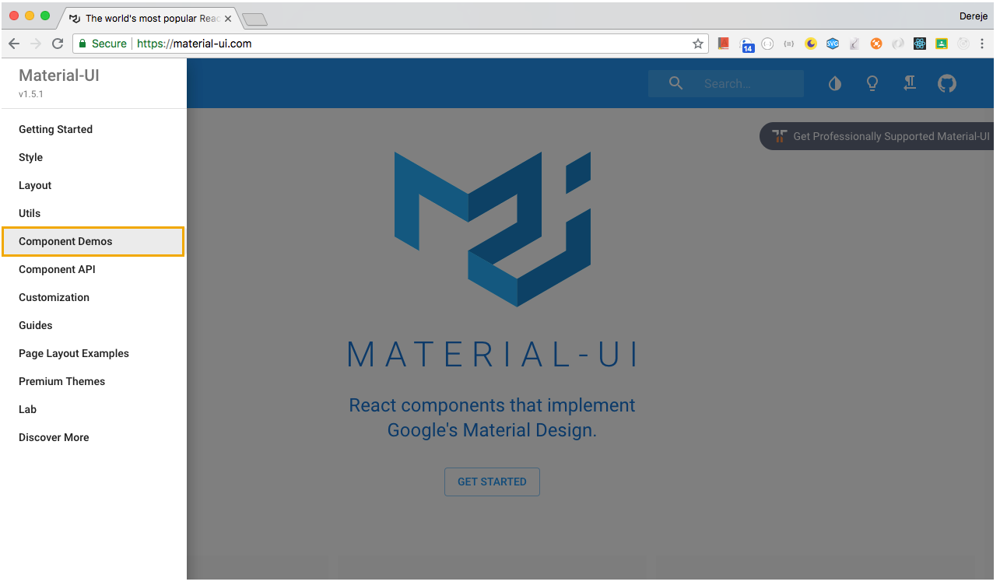

# Install dependency
yarn add @material-ui/core@1.4.3 @material-ui/icons@2.0.2 react-reveal@1.2.2 react-scroll@1.7.9 react-slick@0.23.1

# [Mzterial ui](https://material-ui.com/)
 

 # Resources used
 react slick github
 https://github.com/akiran/react-slick
 
 https://github.com/rnosov/react-reveal